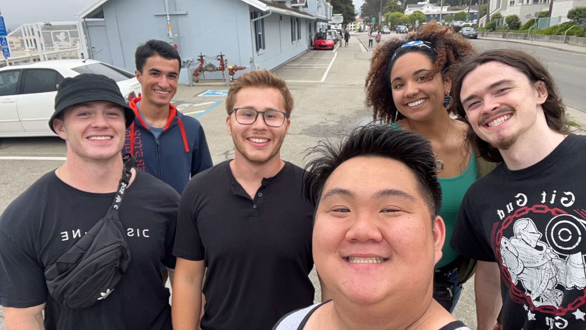

I am a fourth-year Applied Mathematics student at Univerity of California, 
Santa Cruz. Currently, I am interested in the world of Artificial Intelligence
and Software Development. More specifically, I am intrigued by how we can automate
processes in our everyday life which can then give us more time to do the things we
love. 

Outside of working on projects and school, I am an avid musician. I have future plans
to post more content on this website showing the music I have been working on. However,
currently I am just focusing on getting this website up and running.

Thank you for visiting!