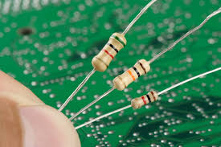
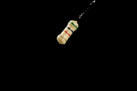
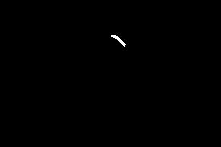

# Ohm-Snap!

This was our project for CruzHacks 2024. We wanted to create a program that could take a picture of a resistor and through that calculate the resistance in Ohms. 

My work was focused on the computer vision portion, attempting to use OpenCV to process these images and retain the spatial dimensions of the bands on the resistors while effectively preserving their color in the proper order. 

In the end we used Meta's SAM (Segment Anything Model) to handle the segmentation, which was able to properly segment the bands. However with lack of time we were not able to complete the rest of the project.

Here's a showcase of our progress. We started with an image of resistors found online, then processed it through SAM to segment the resistor body.

  

After segmentation, we obtained the resistor with the color bands preserved. We then performed bit multiplication on the original image to maintain the resistor with its original colors. 

  

Finally, we used SAM again to differentiate and isolate the individual color bands on the resistors. 

  

